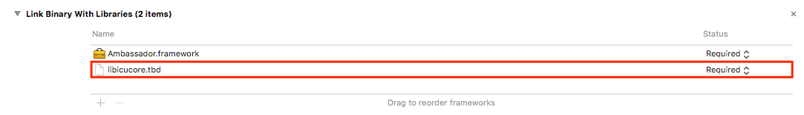

# Ambassador iOS SDK

## Installation
The preferred way to install the framework is with CocoaPods.  Add a dependency in your Podfile with the following line:
  
<b> pod 'Ambassador'</b>

<b> Note </b>  
<i> If you don't use CocoaPods, see the alternative way to install the SDK in your project in our Official Documentation below. </i>

Next, you'll need to go to <b>Build Phases</b> in your project and link the following library:

<b> libicucore.tbd </b>

 

## Usage

#### For instructions on how to use the SDK, check out our <a href="https://docs.getambassador.com/v2.0.0/page/ios-sdk">Official Documentation</a>.
